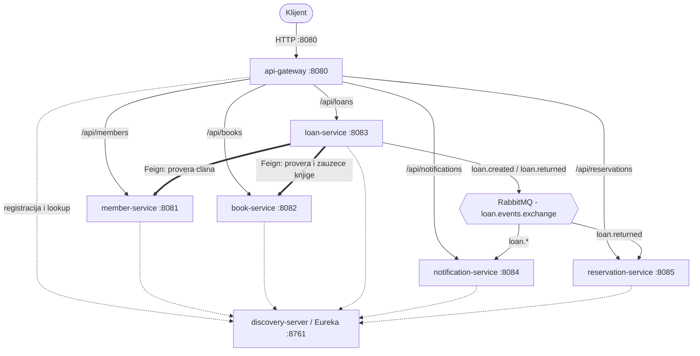

# BiblioNet - Mikroservisni sistem za biblioteku

Mikroservisni sistem za pozajmljivanje knjiga u biblioteci, sa redom čekanja za knjige
koje su trenutno pozajmljene.

## Poslovna logika

1. Bibliotekar unosi **članove** i **knjige**.
2. Član **pozajmljuje** knjigu. Sistem proverava da li član postoji, da li knjiga postoji
   i da li je dostupna. Ako jeste, knjiga se označava kao nedostupna, a rok je 14 dana.
3. Ako je knjiga zauzeta, član je može **rezervisati** i time ući u red čekanja.
4. Kada se knjiga **vrati**, oslobađa se i obaveštava se **prvi član iz reda** (FIFO).
5. Svaka pozajmica i vraćanje generišu **obaveštenje**.

Korake 4 i 5 sam izvela asinhrono, jer nema razloga da pozajmica čeka da se obaveštenja
obrade.

## Tehnologije

Java 17, Spring Boot 3.5.3, Spring Cloud 2025.0.0 (Eureka, Gateway MVC, OpenFeign),
RabbitMQ, Spring Data JPA + H2, Maven, Docker Compose, GitHub Actions, JUnit 5 + Mockito.

## Arhitektura



Isprekidana linija je registracija na Eureku, dupla linija sinhroni Feign poziv, puna
linija HTTP rutiranje ili asinhrona poruka.

| Servis | Port | Uloga |
|---|---|---|
| discovery-server | 8761 | Eureka, registar servisa |
| api-gateway | 8080 | Ulazna tačka, rutiranje preko `lb://` |
| member-service | 8081 | Članovi |
| book-service | 8082 | Katalog knjiga i dostupnost |
| loan-service | 8083 | Pozajmljivanje, vraćanje, objava događaja |
| notification-service | 8084 | Obaveštenja iz događaja |
| reservation-service | 8085 | Red čekanja (FIFO) |

Svaki servis ima sopstvenu bazu i sopstvene DTO klase. Namerno nisam pravila zajedničku
biblioteku modela, jer bi to spojilo servise u monolit sa mrežom između.

## Discovery i rutiranje

Servisi se pri pokretanju registruju na Eureku pod svojim `spring.application.name`, pa
nijedan ne zna IP adrese ostalih nego im se obraća logičkim imenom.

Gateway je jedina tačka koju klijent vidi. Rute sam definisala sa `StripPrefix=1`, pa se
prefiks `/api` skida pre prosleđivanja: `/api/members/**` ide na `lb://MEMBER-SERVICE`
kao `/members/**`. Prefiks postoji samo na gateway-u, sami servisi za njega ne znaju.
`lb://` znači client-side load balancing: gateway pita Eureku za instance i bira jednu.

## Sinhrona komunikacija (Feign)

Feign koristim tamo gde je odgovor potreban odmah, da bi se odluka mogla doneti.
`loan-service` pri kreiranju pozajmice zove `GET /members/{id}` (postoji li član),
`GET /books/{id}` (postoji li knjiga i da li je slobodna) i `PATCH /books/{id}/availability`
(zauzimanje knjige). Ako servis nije dostupan, vraćam **503** umesto 500.

Lokalna transakcija ne može da pokrije udaljeni poziv, pa se upis u bazu i poziv ka
`book-service` izvršavaju odvojeno, a neuspeh **kompenzujem** ručno: ako `PATCH` ne uspe
nakon što je pozajmica upisana, pozajmicu poništavam. Kod vraćanja je obrnuto, pozajmica
se vraća u `ACTIVE`.

## Asinhrona komunikacija (RabbitMQ)

Poruke koristim tamo gde niko ne čeka rezultat. `loan-service` objavljuje `LoanEvent` na
topic exchange **`loan.events.exchange`**:

```json
{ "eventType": "LOAN_CREATED", "loanId": 1, "memberId": 5, "bookId": 7,
  "timestamp": "2026-08-13T18:30:00" }
```

| Producer | Routing key | Consumer | Queue | Binding | Reakcija |
|---|---|---|---|---|---|
| loan-service | `loan.created` | notification-service | `notification.queue` | `loan.*` | Kreira obaveštenje |
| loan-service | `loan.returned` | notification-service | `notification.queue` | `loan.*` | Kreira obaveštenje |
| loan-service | `loan.returned` | reservation-service | `reservation.queue` | `loan.returned` | Prvi u redu prelazi u `NOTIFIED` |

`reservation-service` sam vezala na tačan key `loan.returned`, a ne na `loan.*`, jer se red
pomera samo kada se knjiga oslobodi.

Objava događaja je **best-effort**: ako je broker nedostupan, pozajmica i dalje uspeva,
gubi se samo obaveštenje. Događaj se objavljuje tek pošto su baza i `book-service` saglasni.

## Pokretanje

Dockerfile-ovi kopiraju već izgrađen jar, pa se moduli **prvo pakuju**:

```bash
for m in discovery-server api-gateway member-service book-service \
         loan-service notification-service reservation-service; do
  (cd $m && ./mvnw clean package)
done

docker compose up --build
```

Sistem je spreman kada se svih 7 servisa pojavi na Eureka konzoli.

| Adresa | Šta je |
|---|---|
| http://localhost:3000 | Demo konzola |
| http://localhost:8080 | API Gateway |
| http://localhost:8761 | Eureka konzola |
| http://localhost:15672 | RabbitMQ konzola (`guest` / `guest`) |

Zaustavljanje: `docker compose down`. Baze su H2 in-memory, pa se podaci brišu pri restartu.

## Demo konzola

Na **http://localhost:3000** je statična stranica (HTML, CSS, JavaScript bez build koraka,
nginx kontejner) sa panelom za svaki servis i log trakom.

Redosled za demonstraciju: dodaj člana i knjigu, napravi pozajmicu (knjiga **odmah** postaje
zauzeta, to je Feign), drugim članom rezerviši istu knjigu, pa klikni **Vrati**. Bez ijedne
dodatne akcije knjiga se oslobodi, član iz reda pređe u `obavešten` i stigne obaveštenje.

Panele sa rezervacijama i obaveštenjima sam podesila da se osvežavaju na 3 sekunde, pa se
vidi trenutak kada poruka stigne. To je najjasniji način da se pokaže razlika između
sinhrone i asinhrone komunikacije.

Pošto stranica ide sa porta 3000 a API sa 8080, u `api-gateway` sam dodala CORS
konfiguraciju za `localhost`.

## Primeri (kroz gateway na :8080)

```bash
# clan i knjiga
curl -X POST http://localhost:8080/api/members -H "Content-Type: application/json" \
  -d '{"firstName":"Ana","lastName":"Anić","email":"ana@example.com"}'

curl -X POST http://localhost:8080/api/books -H "Content-Type: application/json" \
  -d '{"title":"Na Drini ćuprija","author":"Ivo Andrić","isbn":"978-86-1234-567-8"}'

# pozajmica, knjiga postaje available:false
curl -X POST http://localhost:8080/api/loans -H "Content-Type: application/json" \
  -d '{"memberId":1,"bookId":1}'

# rezervacija zauzete knjige, status WAITING
curl -X POST http://localhost:8080/api/reservations -H "Content-Type: application/json" \
  -d '{"memberId":2,"bookId":1}'

# vracanje, pokrece ceo lanac
curl -X PUT http://localhost:8080/api/loans/1/return

curl http://localhost:8080/api/books/1          # opet slobodna (sinhrono)
curl http://localhost:8080/api/reservations     # clan je NOTIFIED (asinhrono)
curl http://localhost:8080/api/notifications    # novo obavestenje (asinhrono)
```

`DELETE /api/reservations/{id}` otkazuje rezervaciju. Otkazivanje sam napravila kao "meko":
zapis ostaje sa statusom `CANCELLED` umesto da se briše, pa ostaje trag ko je bio u redu, a
otkazana rezervacija ne učestvuje u FIFO redosledu jer se traži samo `WAITING`.

## Testovi

```bash
cd loan-service && ./mvnw clean test
```

| Modul | Testova | Tip |
|---|---|---|
| discovery-server | 1 | Podizanje konteksta |
| api-gateway | 1 | Podizanje konteksta |
| member-service | 22 | Unit (servis), `@DataJpaTest`, `@WebMvcTest`, integracioni |
| book-service | 10 | `@WebMvcTest` |
| loan-service | 24 | `@WebMvcTest`, `@SpringBootTest`, konfiguracioni |
| notification-service | 8 | Unit, `@WebMvcTest`, konverter poruka |
| reservation-service | 13 | `@DataJpaTest`, `@WebMvcTest` |

Pored uobičajenog, pokrila sam i situacije koje se lako previde: kompenzaciju kada
`book-service` padne nasred pozajmice, rad sistema kada je RabbitMQ nedostupan, i FIFO
redosled kroz pravu bazu (jer je redosled osobina upita a ne koda, pa rezervacije namerno
upisujem pogrešnim redom).

Ponašanje entiteta testiram kroz pravu bazu, a ne mokovan repozitorijum, jer se `@PrePersist`
i unique constraint drugačije ne mogu proveriti. Kod `member-service` to znači da se stvarno
proverava da se `membershipDate` upisuje pri čuvanju i da duplirani email zaista puca.

## CI Pipeline

[`.github/workflows/ci.yml`](.github/workflows/ci.yml) se pokreće na svaki push i pull
request ka glavnoj grani:

1. Preuzima kod i podešava Java 17 sa keširanjem Maven zavisnosti
2. Gradi i testira **svih 7 modula paralelno** (matrix), pošto su nezavisni. Podesila sam
   `fail-fast: false` da pad jednog ne prekine ostale, pa se iz jednog pokretanja vidi
   stanje celog sistema.
3. Čuva rezultate testova kao artifact, i onda kada padnu
4. Posle uspešnih testova gradi Docker slike

